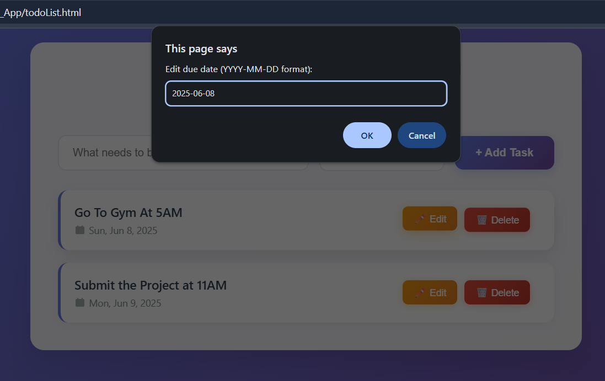

# Modern Todo App

A beautiful, responsive todo list application built with vanilla HTML, CSS, and JavaScript featuring a modern glassmorphism design and smooth animations.

## ✨ Features

- **Modern UI Design**: Clean glassmorphism interface with gradient backgrounds
- **Responsive Layout**: Works seamlessly on desktop and mobile devices
- **Task Management**: Add, edit, and delete tasks with ease
- **Due Date Support**: Set and track due dates for your tasks
- **Visual Feedback**: Smooth animations and hover effects
- **Persistent Storage**: Tasks are saved in browser memory (localStorage ready)
- **Empty State**: Friendly message when no tasks are present

## 🚀 Demo





## 🛠️ Technologies Used

- **HTML5**: Semantic markup structure
- **CSS3**: Modern styling with gradients, animations, and responsive design
- **JavaScript (ES6+)**: Dynamic functionality and DOM manipulation
- **CSS Grid & Flexbox**: Responsive layout system

## 🎯 Usage

1. **Adding Tasks**: 
   - Enter your task in the input field
   - Optionally set a due date
   - Click "Add Task" or press Enter

2. **Editing Tasks**:
   - Click the "Edit" button on any task
   - Modify the task text and/or due date
   - Confirm your changes

3. **Deleting Tasks**:
   - Click the "Delete" button on any task
   - Confirm the deletion

## 📁 Project Structure

```
modern-todo-app/
├── todoList.html      # Main HTML file
├── todo.css          # Styling and animations
├── todo.js           # JavaScript functionality
└── README.md         # Project documentation
```

## 🎨 Design Features

- **Glassmorphism Effect**: Semi-transparent elements with backdrop blur
- **Gradient Backgrounds**: Beautiful color transitions
- **Smooth Animations**: Slide-in effects and hover transitions
- **Modern Typography**: Clean, readable fonts
- **Visual Hierarchy**: Clear distinction between elements
- **Accessibility**: Proper contrast and semantic HTML

### Adding New Features
The modular JavaScript structure makes it easy to add features like:
- Priority levels
- Categories/tags
- Task completion status
- Search functionality
- Data export/import

## 🌐 Browser Compatibility

- Chrome 60+
- Firefox 55+
- Safari 12+
- Edge 79+

## 📱 Mobile Support

The app is fully responsive and works great on:
- iOS Safari
- Chrome Mobile
- Samsung Internet
- Other modern mobile browsers

## 🐛 Known Issues

- Tasks are currently stored in memory only (localStorage implementation ready)
- Date validation could be improved
- No drag-and-drop reordering yet

## 📄 License

This project is licensed under the MIT License - see the [LICENSE](LICENSE) file for details.

## 👤 Author

**Your Name: Pranjal Choudhary**
- GitHub: [@pranjal-git290504](https://github.com/pranjal-git290504)

## 🙏 Acknowledgments

- Design inspiration from modern web applications
- Icons from SVG libraries
- Gradient palettes from UI design resources
---

⭐ **If you found this project helpful, please give it a star!** ⭐
